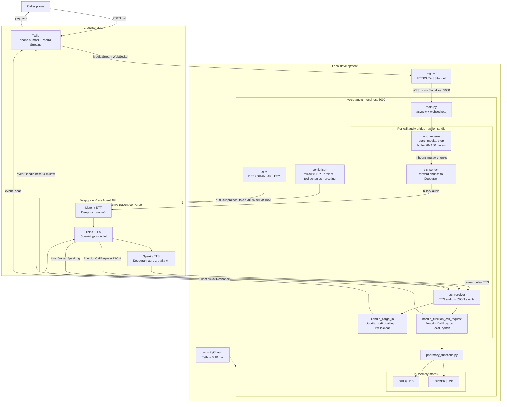
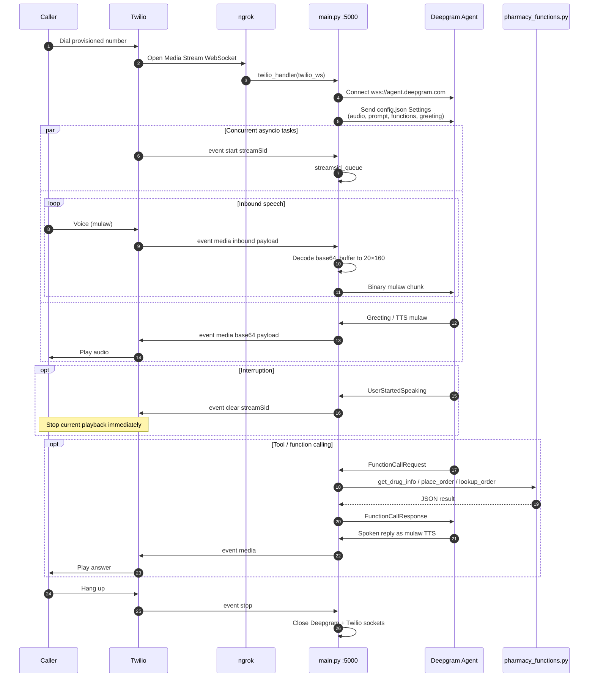
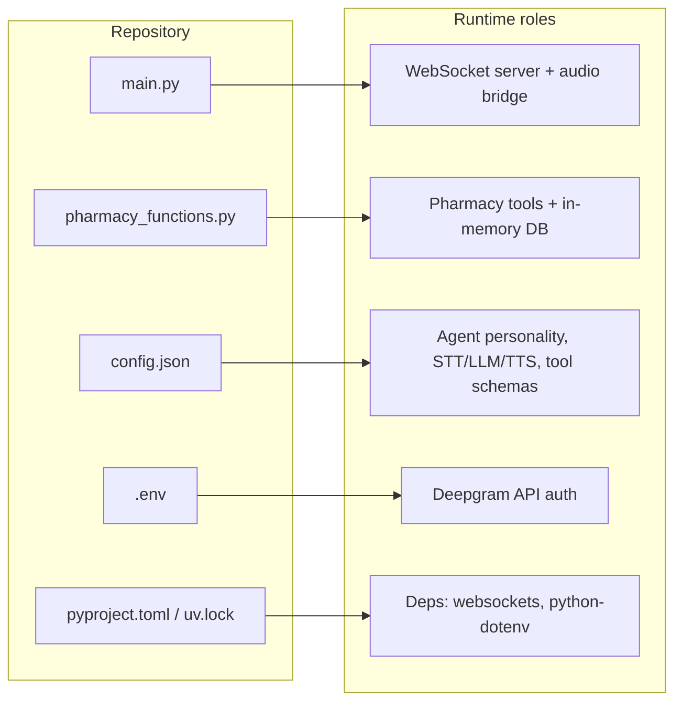

# Architecture

Pharmacy voice agent: Twilio telephony, a local Python WebSocket bridge, and Deepgram's Voice Agent API for speech-to-speech.

## System architecture

## Call workflow

## File-to-role map

## Tech stack

| Layer | Role |
| --- | --- |
| Python (`asyncio` & `websockets`) | Asynchronous backend managing real-time audio socket streams |
| Twilio | Telephony: inbound calls and bidirectional audio via WebSockets |
| Deepgram Voice Agent API | End-to-end speech: STT, LLM reasoning, TTS |
| ngrok | Tunnels local Python server to a public HTTPS/WSS URL for Twilio |
| PyCharm & uv | Python environment setup and dependency management |

## Workflow

1. **Call handling** — A phone call hits a Twilio-provisioned number, which routes the audio stream to the Python server via WebSockets.
2. **Audio bridging** — The Python backend receives inbound mulaw buffers from Twilio and forwards them to Deepgram's WebSocket API in real time.
3. **Speech-to-speech** — Deepgram transcribes speech, feeds text into an LLM with custom prompt instructions, and generates synthetic voice audio.
4. **Real-time playback** — Synthesized audio chunks go back through the Python bridge to Twilio, which streams them to the caller's phone with minimal delay.

## Key functionality

- **Tool / function calling** — The voice agent can execute local Python functions mid-conversation (`get_drug_info`, `place_order`, `lookup_order`) against in-memory drug and order stores.
- **Interruption & stream handling** — Real-time audio chunking and media stream events (`UserStartedSpeaking` → Twilio `clear`) keep latency low and playback stable when the caller talks over the agent.
